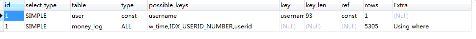

> 创建表

    create table test(a int,b varchar(10),c varchar(10));

> 创建索引

    create index idx_a_b on test(a,b);

> EXPLAIN           explain tbl_name;

    explain select * from event;  

    id:     select查询的序列号
    select_type:    select查询的类型，主要是区别普通查询和联合查询、子查询之类的复杂查询。
    table:      输出的行所引用的表。
    type:       联合查询所使用的类型。结果值从好到坏依次是：

    system(系统表) >
    const(通过索引一次就找到) >
    eq_ref(通过主键或者唯一键索引来访问) >
    ref (多个行匹配)>
    fulltext >
    ref_or_null >
    index_merge(查询中同时使用两个（或更多）索引) >
    unique_subquery(子查询中的返回结果字段组合是主键或者唯一约束) >
    index_subquery >
    range(索引范围扫描) >
    index(全索引扫描) >
    ALL(全表扫描)
    一般来说，得保证查询至少达到range级别，最好能达到ref。

    possible_keys:      指出MySQL能使用哪个索引在该表中找到行。如果是空的，没有相关的索引。这时要提高性能，可通过检验WHERE子句，看是否引用某些字段，或者检查字段不是适合索引。
    key:        显示MySQL实际决定使用的键。如果没有索引被选择，键是NULL，使用了主键，键是primary。
    key_len:        显示MySQL决定使用的键长度。如果键是NULL，长度就是NULL。文档提示特别注意这个值可以得出一个多重主键里mysql实际使用了哪一部分。
    ref:         显示哪个字段或常数与key一起被使用。

### rows:这个数表示mysql要遍历多少数据才能找到，在innodb上是不准确的。

    Extra:
    如果是Only index，这意味着信息只用索引树中的信息检索出的，这比扫描整个表要快。
    如果是Using where，就是使用上了where限制。
    如果是impossible where 表示用不着where，一般就是没查出来啥。
    如果此信息显示Using filesort或者Using temporary的话会很吃力，WHERE和ORDER BY的索引经常无法兼顾，如果按照WHERE来确定索引，那么在ORDER BY时，就必然会引起Using filesort，这就要看是先过滤再排序划算，还是先排序再过滤划算。

   

    EXPLAIN select * from user LEFT JOIN money_log ON `user`.id = money_log.userid where `user`.username= '888888';

### 给money_log表 username添加索引之后的查询

    EXPLAIN select * from user LEFT JOIN money_log ON `user`.id = money_log.userid where `user`.username= '888888';

   

    EXPLAIN select * from user LEFT JOIN money_log ON `user`.id = money_log.userid where `money_log`.userid= '888888';

[官网文档](http://dev.mysql.com/doc/refman/5.5/en/explain-output.html)

[参考文档1](http://www.phpthinking.com/archives/785)

[参考文档2](http://www.cnblogs.com/kongzhongqijing/articles/3544020.html)
