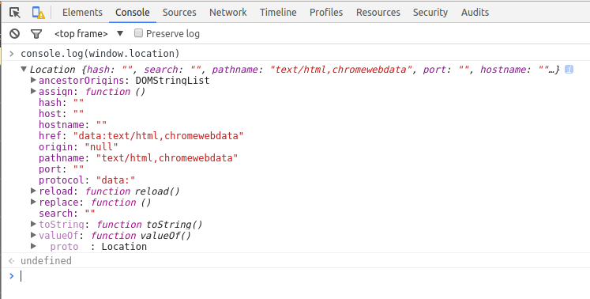

>window 对象

> 控制窗口 框架 和 弹出窗口

> location

> navigator

1. window

    var age = 20;
    window.color = "red";
    delete window.age;
    delete window.color;
    console.log(age);   //20
    console.log(color); //ReferenceError

2. 窗口及框架(frame window.open())

    alert()
    confirm()
    prompt()

3. location

    function getQueryStringArg(){
        var qs = (location.search.length>0?loclocation.search.substring(1):""),
        args = {},
        items = qs.length?qs.split("&"):[],
        item = null,
        name = null,
        value = null,
        i=0,
        len = items.length;
        for(i=0;i<len;i++){
            item = items[i].split("=");
            name = decodeURIComponent(itme[0]);
            value = decodeURIComponent(itme[1]);
            if(name.length){
                args['name'] = value;
            }
        }
        return args;
    }

    var url = "http://baidu.com";
    location.assign(url);
    window.location = url;
    location.href = url;i
